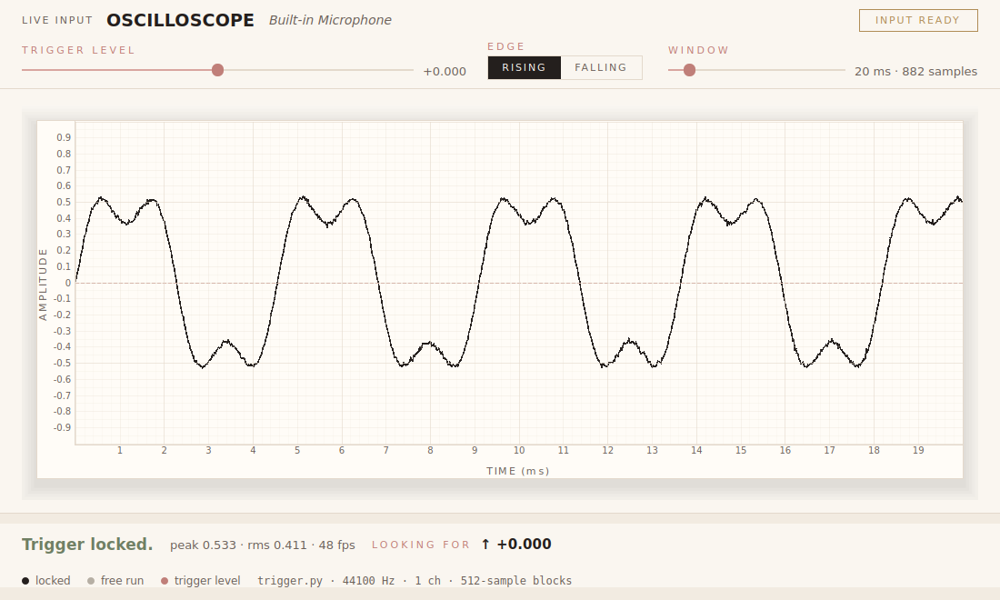
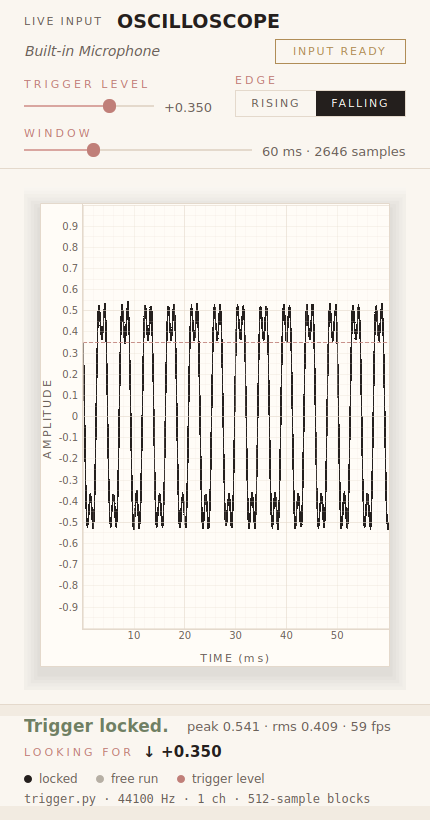

# Real-Time Oscilloscope — POC

A native desktop app that behaves like an analog oscilloscope, driven by live
audio. This is Phase 1: it exists to prove the pipeline works end to end at
interactive framerates, not to be feature complete.

```
[ Audio Input ] -> [ Ring Buffer ] -> [ Trigger Engine ] -> [ Renderer ] -> [ Qt Window ]
```

## Running it

```
pip install -r requirements.txt
python main.py
```

Play a steady tone near the mic (a tuning-fork app, a synth, a sine generator)
and the waveform should stand still rather than scroll.

Useful flags:

```
python main.py --list-devices          # what inputs PortAudio can see
python main.py --device 3              # index or name substring
python main.py --window-ms 5           # start zoomed in
python main.py --trigger-level 0.2 --trigger-edge falling
python main.py --hysteresis 0          # disable trigger noise rejection
```

## Modules

| File | Role |
| --- | --- |
| `branding.py` | The house style, as tokens. The one file allowed to name a colour |
| `ring_buffer.py` | Lock-free circular buffer between the audio thread and the UI |
| `audio_input.py` | `AudioSource` interface + the live `MicrophoneInput` |
| `trigger.py` | Level trigger — finds the edge that makes the trace stand still |
| `renderer.py` | The screen: a plot engraved the way the house prints |
| `main_window.py` | The frame: head, screen, dock, and the redraw timer |
| `main.py` | Wires the pipeline together |

## How the trigger works

Each frame the engine asks the source for `window_length + search_span`
samples and looks for a level crossing inside the first `search_span` of
them. Searching only that leading region guarantees a full window exists
after whichever edge it picks, so frames are never short or zero-padded.

Of the qualifying edges it takes the **most recent** one, which keeps the
displayed frame as close to live as possible — measured lag is ~1 ms.

`hysteresis` (default 0.02) is the scope's noise-rejection band: after firing,
the signal must travel back past `level -/+ hysteresis` before another edge can
fire. Without it, mic noise riding on the trigger level produces a burst of
crossings inside a single cycle and the trace shimmers.

When nothing qualifies — silence, a non-periodic signal, a trigger level the
signal never reaches — the engine falls back to the most recent window and the
status line reads `FREE RUN`. The display keeps moving rather than freezing.

**Known limit:** the trigger lands on a whole sample, so it can sit up to one
sample away from the true crossing. On a 440 Hz tone that is ~0.04 in
amplitude and invisible at normal timebases; it would only start to show on a
very short window of a very high-frequency signal. Sub-sample interpolation is
the fix if that ever matters.

## House style

The surface follows `BRANDING.md` — the same cream paper, charcoal ink, blush
and gold, and the same Playfair / Cormorant / Jost stacks as the rest of the
family. `branding.py` is that document's drop-in block, and it is the only
file here allowed to name a colour; a check fails the build if another one
does.

The page is a lead sheet, so the screen is the sheet: paper one stop brighter
than the page, ruled in `--line`, with the trace as the ink written on it.

**One thing says something in colour, and it is the trigger.** A locked trace
is charcoal; a free-running one is `--unresolved`, which across the house
means open and undecided and is the quietest of the five on purpose. The dock
says the same in words, and the duplication is deliberate — your eye is on the
trace, not the dock. Free run is deliberately *not* rust: a signal with no
edge in it is silence, not a fault, and nothing here calls you wrong. Rust is
kept for the one thing that is a fault, which is clipping.

Four things the web surface gets from CSS and this one builds by hand, each
noted where it is done:

- **`text-transform` and `letter-spacing`** do not exist in Qt's stylesheet
  language, and the small-caps control is most of the page's character — so
  it is `control_font()` plus `caps()` instead.
- **`:focus-visible`** does not exist either, only `:focus`, which rings the
  first control the moment the window opens. `FocusVisible` puts it back out
  of the *reason* Qt gives for each focus change.
- **`flex-wrap`** does not exist, and a row that cannot wrap does not look
  wrong — it sets the window's minimum width and the page stops resizing.
  Three rows here are `Reflow` for that reason.
- **`max-width`** is not a thing a box layout knows, so `wrap()` is the
  1080px centred column.

Depth is used once, on the sheet, and it is the second most expensive thing on
screen — read the note on `Sheet` before touching it.

## Tests

```
python -m unittest discover -s tests
```

29 tests. The 25 engine tests need neither a mic nor a display; the four in
`test_house_style.py` open the real window offscreen and skip where Qt is not
installed.

They cover the ring buffer's writer/reader race under threading, edge finding,
hysteresis, the untriggered fallback, and — standing in for acceptance
criterion 2 — that a steady tone fed in ragged block sizes produces frames
that overlay each other to within one sample-step.

Three of them are `BRANDING.md`'s own checklist, as checks rather than good
intentions, and all three are things this got wrong first: no hard-coded
colour outside `branding.py`, the frame fits a 430px window, and the dock's
readout reserves its height in every state.

## Measured behaviour

From a 60-second headless run against a synthetic 440 Hz source (offscreen
software rendering in a container; real hardware should do better):

- 53–58 fps sustained at a 60 fps target
- triggered on 1587/1587 frames of steady tone
- display lag flat at ~1.1 ms throughout, no buildup
- RSS flat at 93 MB
- cutting to silence kept the display running (`FREE RUN`), and it re-locked
  immediately when the tone returned





## Not built yet

File playback (Phase 2), X-Y / Lissajous mode (Phase 4), phosphor persistence
(Phase 5), full control panel (Phase 6), FFT mode.

The seams for these are already here: `AudioSource` is the swap point for a
file player, and the trigger engine and renderer never learn where their
samples came from.
