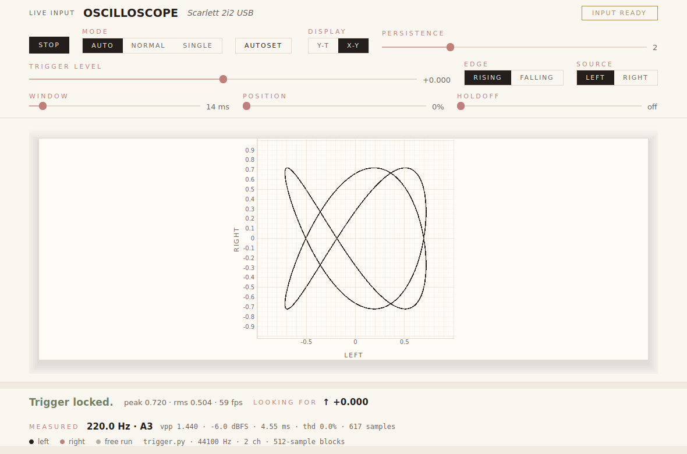
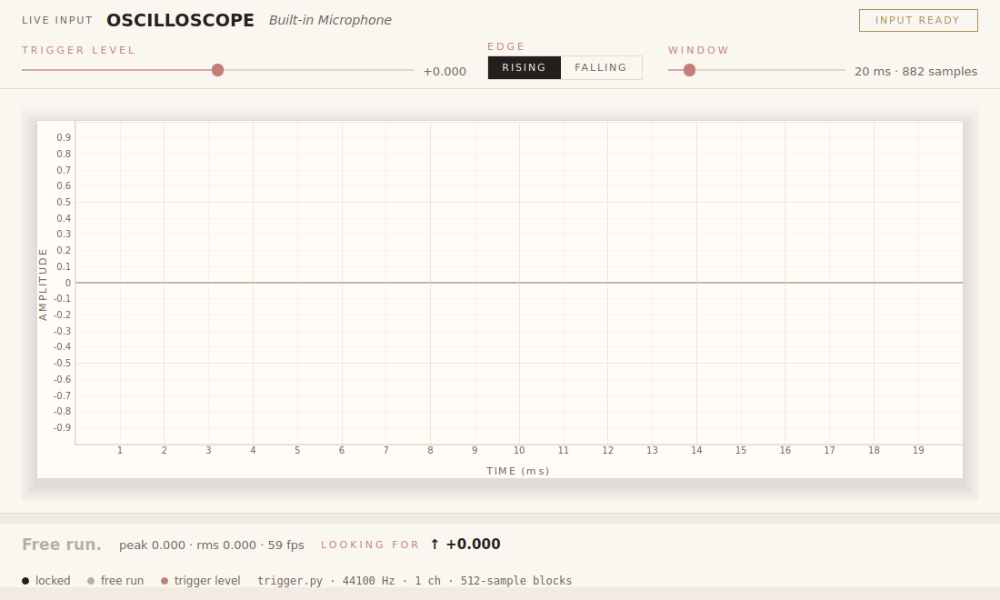

# Real-Time Oscilloscope — POC

A native desktop app that behaves like an analog oscilloscope, driven by live
audio. The pipeline is the point: audio in, aligned, drawn, sixty times a
second, with the controls a bench scope has rather than the ones a plotting
library makes easy.

```
[ Audio Input ] -> [ Ring Buffer ] -> [ Trigger Engine ] -> [ Renderer ] -> [ Qt Window ]
```

## Running it

```
pip install -r requirements.txt
python main.py
```

Play a steady tone near the mic (a tuning-fork app, a synth, a sine generator)
and the waveform should stand still rather than scroll.

Useful flags:

```
python main.py --list-devices          # what inputs PortAudio can see
python main.py --device 3              # index or name substring
python main.py --window-ms 5           # start zoomed in
python main.py --channels 2            # second trace, and X-Y
python main.py --trigger-level 0.2 --trigger-edge falling
python main.py --position 0.4          # show what happened before the edge
python main.py --holdoff-ms 3          # ignore edges with one close behind
python main.py --hysteresis 0          # disable trigger noise rejection
```

## What is on the page

The strip under the title is the transport, in three rows ordered by how
often a hand lands on them.

| Control | What it does |
| --- | --- |
| **run / stop** | Freezes the display without stopping the capture |
| **auto / normal / single** | Auto draws every frame; normal holds the last locked one rather than showing an untriggered frame; single keeps the first and stops |
| **autoset** | Reads the signal, then sets the timebase to four cycles, the level to the signal's own midpoint, and the hysteresis to a twentieth of its swing |
| **y-t / x-y** | The waveform against time, or left against right — the figure two channels make together |
| **persistence** | Up to eight past frames left on the paper behind the live one |
| **trigger level / edge / source** | Where the edge is, which way through it, and which channel is watched |
| **window** | How much time is on screen, 2–200 ms |
| **position** | How much of the window sits *before* the edge |
| **holdoff** | How much quiet an edge needs behind it to qualify |

The dock under the screen says in words what the screen just said, and then
measures the frame: frequency, the note it is, peak-to-peak, level in dBFS,
period, and total harmonic distortion.

X-Y needs two channels; on a mono input the dock says so rather than drawing
a diagonal that means nothing. In X-Y the display is square, because a circle
that is not round is a phase reading that is wrong.



## Modules

| File | Role |
| --- | --- |
| `branding.py` | The house style, as tokens. The one file allowed to name a colour |
| `ring_buffer.py` | Lock-free circular buffer between the audio thread and the UI |
| `audio_input.py` | `AudioSource` interface + the live `MicrophoneInput` |
| `trigger.py` | Level trigger — finds the edge that makes the trace stand still |
| `measure.py` | What a frame measures: frequency, note, level, harmonics |
| `renderer.py` | The screen: a plot engraved the way the house prints |
| `main_window.py` | The frame: head, screen, dock, and the redraw timer |
| `main.py` | Wires the pipeline together |

## How the trigger works

Each frame the engine asks the source for `window_length + search_span`
samples and looks for a level crossing inside the first `search_span` of
them. Searching only that leading region guarantees a full window exists
after whichever edge it picks, so frames are never short or zero-padded.

Of the qualifying edges it takes the **most recent** one, which keeps the
displayed frame as close to live as possible — measured lag is ~1 ms.

`hysteresis` (default 0.02) is the scope's noise-rejection band: after firing,
the signal must travel back past `level -/+ hysteresis` before another edge can
fire. Without it, mic noise riding on the trigger level produces a burst of
crossings inside a single cycle and the trace shimmers.

`position` is what makes the window start *before* the edge. The search is
bounded at both ends, so whichever edge it picks has the run-up behind it and
the rest of the window in front — no short frames, and no padding with silence
that was never recorded. Those samples were always in the ring buffer; until
this, nothing read them.

`holdoff` is stated as a quiet interval **before** an edge rather than as a
lockout timer after one. A bench scope runs the timer because it sweeps once
per trigger; this re-scans a sliding buffer every frame, and a timer anchored
to wherever the buffer happens to start would drift a little each frame and
jitter the trace. Anchored to the signal it is stable and does the same job:
the edge that opens a cycle has nothing close behind it and survives, while a
second crossing mid-cycle does not.

The cost of stating it that way is that a holdoff wider than the signal's own
period disqualifies every edge there is. Free running is the honest answer
there, and the dock names the setting that caused it rather than letting it
read as silence.

When nothing qualifies — silence, a non-periodic signal, a trigger level the
signal never reaches — the engine falls back to the most recent window and the
status line reads `FREE RUN`. The display keeps moving rather than freezing.

**Known limit:** the trigger lands on a whole sample, so it can sit up to one
sample away from the true crossing. On a 440 Hz tone that is ~0.04 in
amplitude and invisible at normal timebases; it would only start to show on a
very short window of a very high-frequency signal. Sub-sample interpolation is
the fix if that ever matters.

## House style

The surface follows `BRANDING.md` — the same cream paper, charcoal ink, blush
and gold, and the same Playfair / Cormorant / Jost stacks as the rest of the
family. `branding.py` is that document's drop-in block, and it is the only
file here allowed to name a colour; a check fails the build if another one
does.

The page is a lead sheet, so the screen is the sheet: paper one stop brighter
than the page, ruled in `--line`, with the trace as the ink written on it.

**Two things say something in colour.** The first is the trigger: a locked
trace is charcoal; a free-running one is `--unresolved`, which across the
house means open and undecided and is the quietest of the five on purpose.
The dock says the same in words, and the duplication is deliberate — your eye
is on the trace, not the dock. Free run is deliberately *not* rust: a signal
with no edge in it is silence, not a fault, and nothing here calls you wrong.
Rust is kept for the one thing that is a fault, which is clipping.

The second is the right channel, which is the accent — the accent at rest
rather than the accent doing work, because the right channel is not more
important than the left, it is the other one. Two traces have to be told
apart and the house has exactly one way to say *this one, not that one*.

Four things the web surface gets from CSS and this one builds by hand, each
noted where it is done:

- **`text-transform` and `letter-spacing`** do not exist in Qt's stylesheet
  language, and the small-caps control is most of the page's character — so
  it is `control_font()` plus `caps()` instead.
- **`:focus-visible`** does not exist either, only `:focus`, which rings the
  first control the moment the window opens. `FocusVisible` puts it back out
  of the *reason* Qt gives for each focus change.
- **`flex-wrap`** does not exist, and a row that cannot wrap does not look
  wrong — it sets the window's minimum width and the page stops resizing.
  Four rows in the dock and head are `Reflow` for that reason, and below the
  breakpoint every group in the transport turns into a column of its own.
- **`max-width`** is not a thing a box layout knows, so `wrap()` is the
  1080px centred column.
- **`overflow: auto` with a content-sized box** is not either: a scroll area
  has no opinion about how tall its contents are. Eleven stacked controls
  would leave the trace a strip at 430px, so `Strip` answers with its
  contents' height and the window caps it.

Depth is used once, on the sheet, and it is the second most expensive thing on
screen — read the note on `Sheet` before touching it.

## Tests

```
python -m unittest discover -s tests
```

61 tests. The engine and measurement tests need neither a mic nor a display;
the rest open real widgets offscreen.

| File | What it holds to account |
| --- | --- |
| `test_ring_buffer.py` | The writer/reader race, under threads |
| `test_trigger.py` | Edge finding, hysteresis, pre-trigger, holdoff, stereo, the untriggered fallback |
| `test_measure.py` | Pitch, distortion, and — mostly — the readings that are withheld |
| `test_renderer.py` | Which curves are on the plot, and what shape the stage is |
| `test_window.py` | That every knob moves the thing it names |
| `test_house_style.py` | `BRANDING.md`'s own checklist, as checks rather than good intentions |

Standing in for acceptance criterion 2: a steady tone fed in ragged block
sizes produces frames that overlay each other to within one sample-step.

Several of these exist because the thing they check was wrong first, and each
of those says so where it is written — the 256-point transform that read a
pure sine as 36% distorted, the strip that banked an early layout pass and cut
its bottom row in half, the holdoff rule that locked onto whichever edge the
buffer happened to open on.

## Measured behaviour

From a 30-second headless run of the real loop against a synthetic 220 Hz
source fed in 512-sample blocks from a background thread, with two traces and
three frames of persistence on (offscreen software rendering in a container;
real hardware should do better):

- 58.8 fps against a 60 fps target
- triggered on 1738/1738 frames
- per-frame work: 0.91 ms median, 2.71 ms at the 99th percentile
- RSS flat at 91 MB across the run





## Not built yet

File playback, a spectrogram, and cursors. The web surface has all three and
they belong here too.

The seams are already there: `AudioSource` is the swap point for a file
player, `measure.py` already owns the transform a spectrogram would need, and
the trigger engine and renderer never learn where their samples came from.

[`docs/z-axis-lane.md`](docs/z-axis-lane.md) is a design that was worked out
and deliberately not built: a third signal that modulates the beam's
brightness rather than its position, which is what blanked flyback and real
depth cueing need. It concerns the web surface rather than this one, and it is
written down in enough detail to pick up without re-deriving it.
